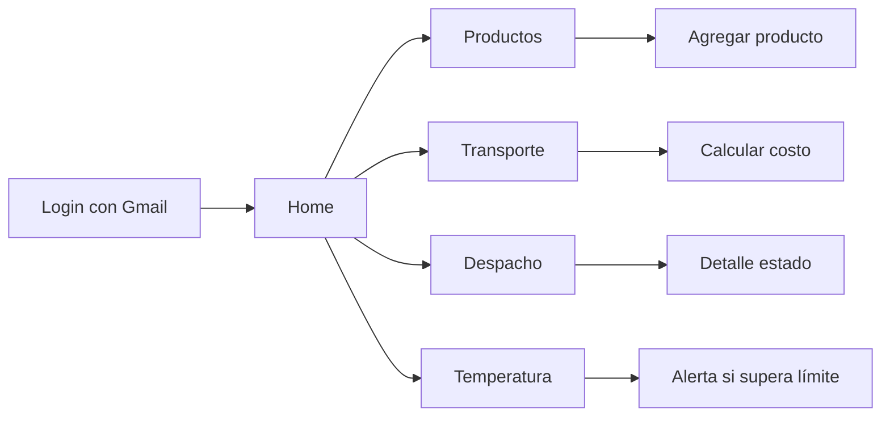

# Prototipo No Funcional 

---

## Mapa de navegación (Mermaid)

> Consejo: pega este bloque en GitHub para ver el diagrama renderizado si usas un visor Mermaid.

---

## 1) Login (Credenciales de Usuario)
**Campos:**
- Correo Gmail
- Contraseña
- Botón **Iniciar sesión**

**Reglas/Validaciones:**
- Formato de correo.
- Campos obligatorios.
- Mensaje de error si credenciales no válidas.

---

## 2) Home
**Accesos rápidos:**
- **Productos**
- **Transporte** (cálculo de despacho)
- **Despacho** (estado de pedidos)
- **Temperatura** (monitoreo cadena de frío)

---

## 3) Productos
**Lista** con: nombre, cantidad, peso y precio (opcional).  
**Acciones:** *Agregar, Editar, Eliminar*.

**Agregar producto — Campos:**
- Nombre (texto)
- Cantidad (entero > 0)
- Peso unitario (kg, decimal ≥ 0)
- Precio unitario (opcional)

---

## 4) Cálculo de Transporte
**Entradas:**
- Distancia (km)
- Peso total (kg) — se puede calcular desde productos

**Reglas de negocio:**
- Total compra ≥ $50.000 → **Despacho gratis**.
- $25.000–$49.999 → **$150/km**.
- < $25.000 → **$300/km**.

**Salida:**
- “Valor estimado de despacho: **$X**”.

---

## 5) Estado de Despacho
**Listado** de pedidos con estado: *Pendiente, En tránsito, Entregado*.  
**Detalle**: número de pedido, fechas y progreso.

---

## 6) Monitoreo de Temperatura
**Elementos UI:**
- Lectura actual en **°C**.
- Botón **Actualizar** (simulación).
- **Alerta visual** si supera el límite configurado.

---

## Wireframes (ASCII)
```
[ Login ]
Correo:  _______________
Clave:   _______________
[ Iniciar sesión ]

[ Home ]
[ Productos ]  [ Transporte ]
[ Despacho ]   [ Temperatura ]

[ Productos ]
- Caja A (2 u / 1.0 kg c/u)   [Editar] [Eliminar]
[ Agregar ]

[ Transporte ]
Distancia (km):  ___
Peso total (kg): ___
[ Calcular ]
Valor estimado: $ ____

[ Temperatura ]
Lectura:  -2,5 °C
[ Actualizar ]   [ Alerta si > Límite ]

[ Despacho ]
#1250  Pendiente
#1249  En tránsito
#1248  Entregado
```
